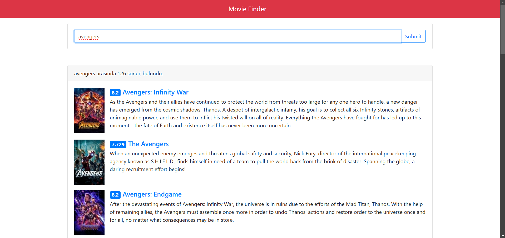
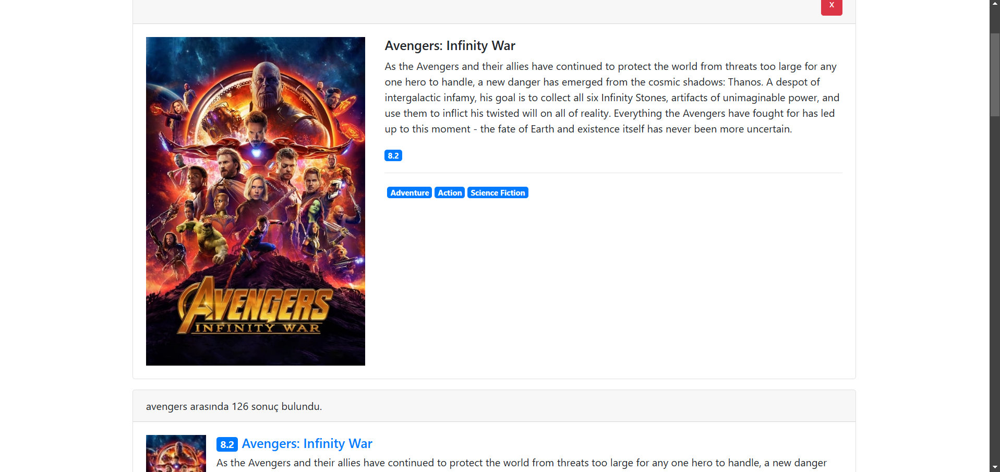

# 🎬 Movie Finder

**Movie Finder** uygulaması, kullanıcılara film arama ve detaylarını görüntüleme imkanı sunan bir web uygulamasıdır. Uygulama, **The Movie Database API**'yi kullanarak film bilgilerini alır ve kullanıcıların istedikleri filmle ilgili verileri görüntülemelerini sağlar.

## Proje Konusu

Bu proje, kullanıcılara **film arama** ve **film detaylarını görüntüleme** gibi işlemleri yapabilme imkanı sunan bir **Movie Finder uygulaması**dır. Kullanıcılar, istedikleri film hakkında bilgi arayabilir ve detaylarına ulaşabilirler.

## Neden Geliştirildi, Motivasyon

Bu uygulamayı geliştirme motivasyonum: **JavaScript ve API entegrasyonunu öğrenmek, DOM manipülasyonu yaparak kullanıcı etkileşimini yönetmek ve Model-View-Controller (MVC) mimarisini uygulamak** istedim.

## Ne Öğrendim?

Bu projeyi geliştirirken aşağıdaki konularda bilgi ve deneyim kazandım:

- **JavaScript**, **DOM manipülasyonu**, ve **API entegrasyonu** kullanarak interaktif bir film arama uygulaması geliştirme.
- **Model-View-Controller (MVC) mimarisi** kullanarak uygulama yapısını düzenleme.
- **Event Listener'lar** kullanarak kullanıcı girişlerini yönetme ve uygulama içi etkileşimi artırma.
- **Asenkron işlemler** ve **API'den veri çekme** işlemlerini gerçekleştirme.

## Özellikler  

✅ Film arama (Anahtar kelime ile arama yapabilme)  
✅ Film detaylarını görüntüleme (Film ismi, açıklama, puan, vb.)  
✅ Model-View-Controller (MVC) yapısı ile kod düzeni ve yönetimi  
✅ **The Movie Database API** entegrasyonu  
✅ Kullanıcı dostu ve modern tasarım  

## Kullanılan Teknolojiler

- **HTML** - Yapısal öğeler
- **CSS** - Stil ve tasarım
- **JavaScript** - Uygulama mantığı ve API entegrasyonu
- **The Movie Database (TMDb) API** - Film verileri
- **Model-View-Controller (MVC)** - Uygulama yapısı

## Ekran Görüntüleri

